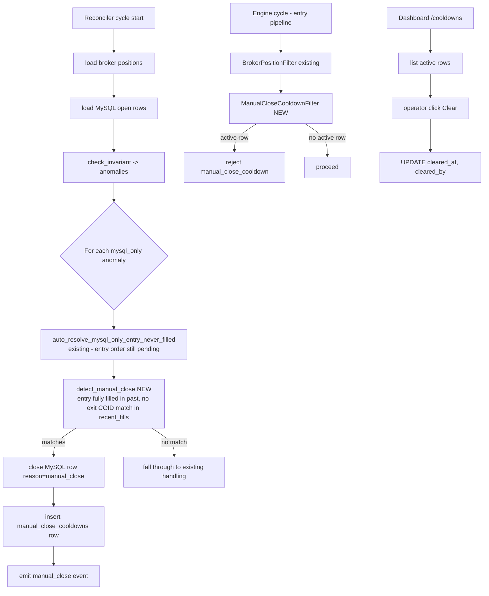

# Manual-Close Cooldown Filter

> **Status**: Done
> **Created**: 2026-06-03

## 1. Business Context

### Problem Statement

When the operator manually closes a position at the broker (Alpaca UI, mobile app, or direct API call), aitrader has no signal that the close was human-initiated. From the engine's view the broker simply reports zero inventory on that symbol — indistinguishable from "we never opened it." On the next bar that triggers a setup, the strategy re-enters and the operator's intent ("I want this position flat *and to stay flat*") is silently overridden.

PR #97 added `BrokerPositionFilter`, which blocks entries while the broker holds inventory. That filter is necessary but insufficient: the instant a manual close fills, the broker reports `qty=0`, the filter passes, and the next signal enters. The operator must then close again — and again — until they disable the strategy through the dashboard.

The same hole exists for broker-side fills the engine didn't request: a stop blown by an exchange-side risk system, a forced liquidation, or a position closed by another tool sharing the account.

### Goals

- Detect that a position present at the broker on cycle N is absent on cycle N+1 **and** that absence was not caused by an aitrader-issued exit.
- After a confirmed manual close, block re-entry on `(strategy_id, normalized_symbol)` for a configurable cooldown window (default 60 minutes).
- Surface the cooldown to the operator: dashboard banner, audit event, and a `manual_close` reject reason in the entry-filter logs.
- Make the cooldown explicitly clearable from the dashboard (operator override) so a human can re-enable mid-window when they actually do want re-entry.

### User Stories

#### US-1: Operator manually flattens a position and expects it to stay flat

- **Story**: As the operator, I want manually closing a position at the broker to also tell aitrader to stop trading that symbol for a while, so I don't have to repeatedly close the same position.
- **Acceptance Criteria**:
  - **Given** strategy `vwap_bands_crypto` holds 1 COIN long and aitrader is running, **when** I close the position via Alpaca's UI, **then** within one reconciler cycle aitrader records a `manual_close` event for `(vwap_bands_crypto, COIN)` and a cooldown row valid for the next 60 minutes.
  - **Given** the cooldown row above is active, **when** the strategy fires a fresh COIN entry signal, **then** the entry is rejected with reason `manual_close_cooldown` and no order is submitted.
  - **Given** the cooldown row above is active, **when** the cooldown window expires, **then** the next valid signal proceeds normally without operator intervention.

#### US-2: Cross-strategy duplicate handling under manual close

- **Story**: As the operator, when two strategies share a symbol and I manually close the broker position, I want the cooldown to apply only to the strategies that actually held an open MySQL row, so unrelated strategies on the same symbol aren't blocked.
- **Acceptance Criteria**:
  - **Given** `ib_crypto` holds 1 BTC and `vwap_bands_crypto` is flat on BTC, **when** I manually close BTC at the broker, **then** the cooldown is recorded for `(ib_crypto, BTC)` only — `vwap_bands_crypto`'s next BTC signal is not blocked by `manual_close_cooldown` (though it is still subject to `BrokerPositionFilter` until aggregate broker inventory is zero).

#### US-3: Operator override to clear a cooldown early

- **Story**: As the operator, I want to clear an active cooldown from the dashboard, so I can re-enable trading on a symbol when the manual close was a one-off and I want the strategy back online immediately.
- **Acceptance Criteria**:
  - **Given** an active cooldown for `(vwap_bands_crypto, COIN)` with 30 minutes remaining, **when** I click "Clear cooldown" on the dashboard's cooldowns panel, **then** the cooldown row is marked cleared with the operator's confirmation logged, and the next signal on that pair proceeds normally.

#### US-4: Audit trail for every manual close

- **Story**: As the operator reviewing daily activity, I want every detected manual close logged with enough context to distinguish it from a regular exit, so I can audit broker-side actions after the fact.
- **Acceptance Criteria**:
  - **Given** a manual close has just been detected, **when** I open the reconciliation events panel, **then** I see a `manual_close` event with `strategy_id`, `symbol`, last known broker qty, last known MySQL row, and the cycle timestamp, distinct from `position_closed` (engine-issued) and `auto_close_*` (reconciler-issued) events.

### Key Scenarios

| Scenario | Pre-conditions | Steps | Expected Result |
|---|---|---|---|
| Happy path: manual close → cooldown → re-entry blocked | `vwap_bands_crypto` has open MySQL row for COIN qty=1; broker reports qty=1 | Operator closes COIN at Alpaca; reconciler runs cycle | MySQL row closed with `close_reason='manual_close'`; cooldown row inserted (60 min); next COIN signal rejected with `manual_close_cooldown` |
| Happy path: cooldown expires | Cooldown active for `(rsi_equity, NFLX)` valid until `t0+60min` | Wait until `t0+60min+1`; next NFLX signal | Cooldown filter resolves to `expired`; entry proceeds |
| Error: aitrader-issued exit fill, not manual | `vwap_bands_crypto` has open MySQL row for COIN; engine submits exit market sell with COID `vwap_bands_crypto:vwap_bands:COIN:exit:...` | Exit fills; reconciler runs next cycle | `recent_fills` contains a tagged exit COID matching the row → engine close-fill path runs as today; **no** `manual_close` event; **no** cooldown row |
| Error: stop-loss bracket child fills | Strategy holds NFLX long with bracket; stop child fires at the broker | Stop fills with COID `vwap_bands_equity:vwap_bands:NFLX:stop:...`; reconciler cycle | Tagged fill matches `Role.STOP`; treated as engine-issued exit; **no** cooldown row |
| Edge: position disappears during reconciler downtime | Reconciler container crashes for 4 minutes; operator manually closes COIN at minute 1; reconciler restarts at minute 4 | Reconciler comes back, runs first cycle | First cycle still detects broker_absent vs MySQL_open with no matching close-fill in window → records `manual_close` with cycle timestamp **as detection time** (not actual close time) |
| Edge: cross-strategy with one open row | `ib_crypto` open BTC qty=1 (long); `vwap_bands_crypto` flat on BTC; broker reports qty=1 | Operator closes BTC at Alpaca | Cooldown row only for `(ib_crypto, BTC)`. `vwap_bands_crypto` next BTC signal passes the manual-close filter (no row for it). |
| Edge: partial manual close | `vwap_bands_crypto` open ETH qty=2; operator manually sells 1 ETH | Reconciler cycle | Detected as `qty_drift` (broker=1, MySQL=2), not `manual_close`. `qty_drift` resolution path handles it. **Manual-close detection only fires when broker side goes from nonzero to zero.** |
| Edge: dust residual | After manual close, broker reports 0.0000003 ETH (dust below `qty_eps`) | Reconciler cycle | Treated as effectively zero (broker_norm strips below `qty_eps` already). Behaves identically to a clean zero — `manual_close` detected. |
| Edge: operator clears cooldown immediately | Cooldown row inserted at t0, valid until t0+60min | Operator clicks "Clear cooldown" at t0+5min | Row marked `cleared_at=now(), cleared_by='operator'`; next signal proceeds; original event remains for audit |

### Functional Requirements

1. **Detection.** On every reconciler cycle, identify positions that satisfy *all* of:
   - Had an open MySQL row at the start of the previous cycle.
   - Broker reports zero (or sub-`qty_eps`) inventory on the normalized symbol now.
   - No `recent_fills` in the cycle window match any exit COID for any open MySQL row on that `(strategy_id, symbol)`.
2. **Closure.** When detection fires, close the MySQL row(s) with `close_reason='manual_close'` at the last known broker price (or the row's entry price if no price snapshot is available — same fallback used by `auto_close_entry_never_filled`).
3. **Cooldown row.** Insert one row into `manual_close_cooldowns` per closed MySQL row with default duration 60 minutes (env: `MANUAL_CLOSE_COOLDOWN_MIN`, range 0–1440; 0 means "log but don't block").
4. **Entry filter.** Add `ManualCloseCooldownFilter` to the entry pipeline in both `main.py` and `main_gap_and_go.py`. The filter:
   - Reads active cooldown rows for `(strategy_id, normalized_symbol)` once per cycle (TTL cache identical to `BrokerPositionFilter`).
   - Rejects with `reason="manual_close_cooldown"` and `details={"cleared_after": <iso8601>}` when a row is found.
5. **Operator override.** Dashboard exposes a "Cooldowns" panel listing active rows and a per-row "Clear" button. Clearing sets `cleared_at` and `cleared_by` on the row but never deletes it.
6. **Audit event.** Reconciler emits a `manual_close` event into `reconciliation_events` containing `{strategy_id, symbol, last_broker_qty, mysql_row_qty, cooldown_until, mysql_row_id}`.
7. **Idempotency.** Re-detecting the same `(strategy_id, symbol)` while a cooldown row is already active is a no-op — only emit `manual_close_redetected` event without inserting a new row or re-closing.

### Non-Functional Requirements

- **Latency.** Detection must complete within one reconciler cycle (default `RECONCILE_INTERVAL_S=30`). End-to-end "manual close at broker → cooldown active" ≤ 60 seconds at p99.
- **Safety.** False positives must be impossible for engine-issued exits. The detection rule must depend on COID-based fill attribution, **not** on heuristics like "we expected this row to be open."
- **Observability.** Every state transition (detected → cooldown active → expired/cleared) emits an event. Dashboard reflects active cooldowns and recent expirations.
- **Backward compatibility.** Pre-existing `position_closed` and `auto_close_*` paths are not modified. Schema migration adds one table; no existing tables change.
- **Asset-class isolation.** Cooldowns are stamped with `asset_class` matching the reconciler instance that created them. Equity reconciler cannot create a crypto cooldown and vice versa.

### Out of Scope

- Detection of partial manual closes (broker qty reduced but nonzero). That case already routes to `qty_drift` and is handled there.
- Auto-pausing the entire strategy on N manual closes per day. The cooldown is per-symbol; strategy-wide circuit breakers stay where they are (`risk/circuit_breaker.py`).
- Cooldowns triggered by reconciler-issued auto-closes (`auto_close_qty_drift_surplus`, `auto_close_broker_only`, etc.). Those are aitrader-initiated and should not block re-entry — the strategy should remain free to re-enter after the reconciler cleans up its own mess.
- Multi-account concerns beyond the existing per-asset-class split. Cooldowns key on `(strategy_id, symbol)` which already implicitly scopes by asset class.
- UI for adjusting cooldown duration per-symbol or per-strategy. Single global env var only.

---

## 2. Arch Decisions

### Proposed Solution

Add manual-close detection to the reconciler's main loop, after `auto_resolve_qty_drift` and before `auto_close_broker_only`, as a fourth remediation pass. Detection runs on the same `mysql_only` anomaly set that the existing `auto_resolve_mysql_only_entry_never_filled` pass consumes — but with an *opposite* heuristic: that path catches "MySQL row open, entry order never filled at broker" (so the row is wrong); this path catches "MySQL row open, entry definitely *did* fill, broker now reports zero, no exit fill in our recent_fills window" (so the row is right but the position was closed externally).

A new table `manual_close_cooldowns` persists active windows. A new entry filter `ManualCloseCooldownFilter` reads it. The dashboard gets a small panel for visibility and override.

### Architecture Overview



### Alternatives Considered

| Alternative | Pros | Cons | Verdict |
|---|---|---|---|
| Detect manual closes from Alpaca trade-update stream | Real-time; can see who initiated the close (manual vs algo) | Aitrader doesn't currently consume the stream; major new dependency; stream auth tied to single account; reliability across reconnects | **Rejected** — too much surface area for the value |
| Trust `recent_fills` absence alone, no separate detector — just close any `mysql_only` row with no matching exit COID | Tiny code change | Cannot distinguish manual close from "exit COID submitted but fill arrives next cycle" — high false-positive risk; would also reclassify the `entry_never_filled` case incorrectly | **Rejected** — unsafe |
| Skip cooldown table — instead rely on operator pressing "disable strategy" | No new state | Defeats the purpose; the current pain *is* the operator manually disabling repeatedly | **Rejected** |
| Use the existing `reconciliation_strikes` table with a new `direction='manual_close'` | Reuses infrastructure | `strikes` is keyed and indexed for "anomaly persists across cycles" semantics; manual-close cooldown is a single-shot timer with a clear window — different lifecycle, different queries | **Rejected** — wrong abstraction |
| Cooldown is per `(strategy_id, symbol, side)` rather than `(strategy_id, symbol)` | Allows re-entry on opposite side | Operationally surprising — operator closes a long, strategy immediately enters short on the next reversal signal; same intent violation | **Rejected** — keep simple, all sides blocked |

### Risks & Mitigations

| Risk | Impact | Likelihood | Mitigation |
|---|---|---|---|
| False positive: aitrader exit fill arrives in a later cycle than the broker-side qty zero observation, gets misclassified as manual close | Med — closes a row with wrong `close_reason`, blocks legitimate re-entry | Med | Detection requires that the previous cycle's `last_observed_state` showed broker qty matching MySQL — a one-cycle lag in fills propagation looks like normal qty_drift, not manual_close. Detection only fires after **two** consecutive cycles where broker=0 and no exit COID seen, mirroring `strike_threshold` discipline (configurable: `MANUAL_CLOSE_CONFIRM_CYCLES`, default 2). |
| False negative: operator closes manually and aitrader exit fill *also* happens in the same cycle (race) | Low — engine close-fill path runs, no cooldown set, operator must close again | Low | Acceptable. The race is rare; the visible audit event distinguishes the two paths so the operator knows what happened. |
| Cooldown table grows unbounded | Low — cleanup query needed | High over months | Background cleanup at reconciler startup deletes rows older than 7 days; index on `(cleared_at, cooldown_until)` keeps active-row lookups O(log n). |
| Operator is confused why a strategy isn't trading after a manual close | Med — silent rejection | Med | Two surfaces: dashboard "Cooldowns" panel listing active rows with countdown; entry-filter logs include `manual_close_cooldown` reason. Both already wired to the existing reject-tracking infra. |
| Multiple strategies on same symbol — one closed by operator, but cooldown applies broadly | Low — operator may want only the one-strategy cooldown | Low | Per-(strategy_id, symbol) keying is already narrow. We do not propagate across strategies sharing a symbol. |

### Key Decisions

#### Decision 1: Detection lives in the reconciler, not the trader engine

- **Status**: Accepted
- **Context**: The trader engine has direct access to the `PositionBook` and is closer to entry signals, but it doesn't have the cross-strategy aggregate view nor the `recent_fills` window with COID attribution. The reconciler already computes the exact information needed and runs every 30s.
- **Decision**: Detection is a new function `detect_manual_close()` in `reconciler/main.py`, called from `run_one_cycle()` after `auto_resolve_mysql_only_entry_never_filled` and before `auto_close_broker_only`.
- **Consequences**: Up to 30s latency between manual close and cooldown activation. Acceptable because the operator's intent is preserved within one minute. Engine entry filter only reads cooldown state, never writes it — clean separation.

#### Decision 2: Cooldown stored in a dedicated table, not in `positions` or `strikes`

- **Status**: Accepted
- **Context**: Need a queryable, indexable record of `(strategy_id, symbol, started_at, cooldown_until, cleared_at, cleared_by)`. Existing tables don't fit cleanly.
- **Decision**: New table `manual_close_cooldowns`. Schema in §3.
- **Consequences**: One migration. Filter queries are direct: `WHERE strategy_id=? AND symbol IN (?,?) AND cleared_at IS NULL AND cooldown_until > NOW()`. Cleanup query at startup.

#### Decision 3: Detection requires N=2 consecutive confirming cycles by default

- **Status**: Accepted
- **Context**: A single cycle can race with an aitrader-issued exit fill that arrives slightly later. Requiring two consecutive cycles where (broker=0, MySQL=open, no exit COID in the recent_fills window) eliminates that race for the engine's own exits.
- **Decision**: Add `MANUAL_CLOSE_CONFIRM_CYCLES` (default 2). Use a new persisted counter on the cooldown row's predecessor — implemented as a lightweight second use of the `reconciliation_strikes` table with `direction='manual_close'` (this is the *one* use of the strikes table that fits — counting confirmations across cycles for a candidate). After threshold, the strike resolves and creates the cooldown row.
- **Consequences**: Up to 60s detection latency in the steady case; trades simplicity for safety. Reuses the existing strike persistence and timing infrastructure; need to add `'manual_close'` to the `direction` ENUM.

#### Decision 4: Cooldown applies to the strategy that owned the closed row, not all strategies on the symbol

- **Status**: Accepted
- **Context**: With cross-strategy duplicates a strong concern (PR #97 motivation), the operator may close a position they think belongs to one strategy when actually multiple held it. Casting the cooldown to all strategies would over-block; casting only to the one whose MySQL row was actually closed is the minimal correct scope.
- **Decision**: Per-(strategy_id, symbol) cooldowns. If the manual close drains broker inventory for two strategies, each gets its own row.
- **Consequences**: Dashboard panel may show multiple rows for the same symbol after a single manual close — explicitly fine; each can be cleared independently.

#### Decision 5: Default cooldown is 60 minutes

- **Status**: Accepted
- **Context**: Too short and the operator must repeatedly close; too long and the strategy is effectively disabled when the operator's intent was a single intervention. 60 minutes spans most intraday signal cycles for the existing strategies (RSI, ORB, VWAP bands).
- **Decision**: `MANUAL_CLOSE_COOLDOWN_MIN=60` in `config/.env`. Per-strategy override via YAML possible later but out of scope here.
- **Consequences**: One global value. Override is one env-var change.

### Implementation Plan

**Phase 1 — Schema and detection (no behavior change for entries yet)**

1. Migration: add `manual_close_cooldowns` table; extend `reconciliation_strikes.direction` ENUM.
2. Add `detect_manual_close()` to `reconciler/main.py`. Wire into `run_one_cycle()` after `auto_resolve_mysql_only_entry_never_filled`.
3. Add `MySQLStore.insert_manual_close_cooldown()`, `get_active_cooldowns()`, `clear_cooldown()`.
4. Tests: `tests/test_reconciler_manual_close.py` covering all six key scenarios.

**Phase 2 — Entry filter**

5. Add `ManualCloseCooldownFilter` in `risk/filters.py` modeled on `BrokerPositionFilter` (TTL cache, fail-open).
6. Wire into `build_pipeline` in `main.py` and `main_gap_and_go.py` immediately after `BrokerPositionFilter`.
7. Tests in `tests/test_filters.py` covering active row, expired row, cleared row, no row.

**Phase 3 — Dashboard**

8. Add a "Cooldowns" panel to the reconciliation tab listing active rows with countdown and a Clear button.
9. Wire `clear_cooldown(id, cleared_by)` to the button. Confirmation dialog.
10. Add cooldown reject reason to the existing entry-filter rejects view (already aggregates `recent_filter_rejects`).

**Phase 4 — Operational hardening**

11. Reconciler-startup cleanup: `DELETE FROM manual_close_cooldowns WHERE cooldown_until < NOW() - INTERVAL 7 DAY`.
12. Document env vars in `.env.example` and `README.md`.
13. Verification checklist run in shadow mode (`SHADOW_MODE=true` skips the close + cooldown insert; only emits `manual_close_shadow` event for one full session before flipping live).

---

## 3. Technical Contract

### Data Models

**New table `manual_close_cooldowns`:**

```sql
CREATE TABLE IF NOT EXISTS manual_close_cooldowns (
    id              BIGINT AUTO_INCREMENT PRIMARY KEY,
    strategy_id     INT NOT NULL,
    symbol          VARCHAR(32) NOT NULL,        -- normalized (broker-flat) form
    asset_class     VARCHAR(16) NOT NULL,        -- 'equity' | 'crypto'
    started_at      TIMESTAMP(3) NOT NULL,
    cooldown_until  TIMESTAMP(3) NOT NULL,
    cleared_at      TIMESTAMP(3) DEFAULT NULL,
    cleared_by      VARCHAR(64) DEFAULT NULL,    -- 'operator' | 'expired' | 'auto_cleanup'
    reconciler_event_id BIGINT DEFAULT NULL,     -- link to reconciliation_events row that triggered this
    last_broker_qty DECIMAL(20,8) DEFAULT NULL,
    last_mysql_qty  DECIMAL(20,8) DEFAULT NULL,
    closed_position_id BIGINT DEFAULT NULL,      -- link to positions.id at time of close
    FOREIGN KEY (strategy_id) REFERENCES strategies(id),
    FOREIGN KEY (reconciler_event_id) REFERENCES reconciliation_events(id),
    INDEX idx_cooldown_active (strategy_id, symbol, cleared_at, cooldown_until),
    INDEX idx_cooldown_until (cooldown_until)
) ENGINE=InnoDB DEFAULT CHARSET=utf8mb4;
```

**Schema change to `reconciliation_strikes`:**

```sql
ALTER TABLE reconciliation_strikes
  MODIFY direction ENUM('qty_drift','mysql_only','broker_only','manual_close') NOT NULL;
```

The `manual_close` direction reuses the strikes machinery purely for confirmation counting: same key format `manual_close:{strategy_id}:{symbol}`, same `strike_count`, same `last_seen_at`. When `strike_count >= MANUAL_CLOSE_CONFIRM_CYCLES`, the cooldown row is inserted and the strike is marked resolved with `resolved_reason='manual_close_confirmed'`.

**No changes to `positions`, `trades`, `reconciliation_events` tables.** A new `close_reason='manual_close'` value is written into `positions.close_reason` and `trades.close_reason` but the columns are already free-form `VARCHAR`.

### Interfaces

**New reconciler function:**

```python
# reconciler/main.py
def detect_manual_close(
    *,
    alpaca: Any,
    store: MySQLStore,
    session: Session,
    anomalies: list[Anomaly],
    broker_positions: dict[str, dict],
    recent_fills: list[dict],
    cfg: ReconcilerConfig,
    now: datetime,
    asset_class: str | None = None,
) -> int:
    """Detect manual closes among mysql_only anomalies.

    Confirmation rule: an mysql_only anomaly whose attributed entry COID
    appears in a *closed* (filled) state at the broker AND whose recent
    fills window contains no matching exit COID is a manual-close
    candidate. After MANUAL_CLOSE_CONFIRM_CYCLES consecutive cycles of
    confirmation, close the row, insert a cooldown, emit event.

    Returns the number of manual closes confirmed this cycle.
    """
```

**New `MySQLStore` methods:**

```python
def insert_manual_close_cooldown(
    self, *, strategy_id: int, symbol: str, asset_class: str,
    started_at: datetime, cooldown_until: datetime,
    last_broker_qty: float | None, last_mysql_qty: float | None,
    closed_position_id: int | None,
    reconciler_event_id: int | None,
) -> int: ...

def get_active_cooldowns(
    self, *, strategy_id: int | None = None, symbol: str | None = None,
    now: datetime | None = None,
) -> list[CooldownRow]: ...

def clear_cooldown(self, cooldown_id: int, *, cleared_by: str) -> None: ...

def cleanup_expired_cooldowns(self, *, older_than_days: int = 7) -> int: ...
```

**New filter:**

```python
# risk/filters.py
class ManualCloseCooldownFilter(EntryFilter):
    """Reject entries when a manual-close cooldown is active for
    (strategy_id, normalized_symbol).

    Reads active cooldowns at most once per `cache_ttl_s` (default 30s).
    Fails open on MySQL errors (does not block trading on infra glitches).
    """
    name = "manual_close_cooldown"

    def __init__(
        self, store: MySQLStore, strategy_id: int,
        cache_ttl_s: float = 30.0,
        now_fn: Callable[[], datetime] = lambda: datetime.now(timezone.utc),
    ): ...

    def check(self, signal, ctx, ledger, book) -> FilterResult: ...
```

**Configuration (env vars):**

| Variable | Default | Range | Purpose |
|---|---|---|---|
| `MANUAL_CLOSE_COOLDOWN_MIN` | 60 | 0–1440 | Cooldown window in minutes; 0 disables blocking but still emits events |
| `MANUAL_CLOSE_CONFIRM_CYCLES` | 2 | 1–10 | Consecutive cycles of confirmation before a cooldown is created |
| `MANUAL_CLOSE_CACHE_TTL_S` | 30 | 1–300 | Filter-side cache TTL for cooldown lookups |

**Audit events emitted to `reconciliation_events`:**

| Event type | Payload |
|---|---|
| `manual_close_candidate` | `{strategy_id, symbol, last_broker_qty, mysql_qty, strike_count, recent_fills_count}` (per cycle while strikes accumulate) |
| `manual_close` | `{strategy_id, symbol, last_broker_qty, mysql_qty, cooldown_until, cooldown_id, closed_position_id}` (on confirmation) |
| `manual_close_redetected` | `{strategy_id, symbol, existing_cooldown_id, current_until}` (already-active cooldown) |
| `manual_close_cleared` | `{cooldown_id, strategy_id, symbol, cleared_by, time_remaining_min}` (operator override) |
| `manual_close_expired` | `{cooldown_id, strategy_id, symbol}` (cleanup pass) |

### Integration Points

- **Reconciler `run_one_cycle()`** — `reconciler/main.py` ~line 1278. New call sequence: `auto_resolve_qty_drift` → `auto_resolve_mysql_only_entry_never_filled` → **`detect_manual_close`** → `auto_close_broker_only`.
- **Trader engine pipeline** — `main.py:283-311` and `main_gap_and_go.py` equivalent. New filter placed immediately after `BrokerPositionFilter` so broker-side and cooldown-side checks run together.
- **MySQLStore** — new public methods added; no existing method signatures change.
- **Dashboard** — new panel on reconciliation tab; reuses existing `mysql_store` accessor; no API change.
- **Schema migration** — `state/schema.sql` updated with the new table and ENUM extension. `MYSQL_DUP_CLEANUP`-style boot-time migration adds the column if missing on legacy DBs.

### Invariants & Constraints

1. **Engine-issued exits never trigger a cooldown.** A fill in `recent_fills` whose `client_order_id` matches the open MySQL row's expected exit COID (any `Role` ∈ {EXIT, STOP, TARGET}) suppresses manual-close detection for that row, full stop.
2. **Cooldowns are append-only.** Rows are never deleted by application code while active; cleanup runs only on rows whose `cleared_at` is set or whose `cooldown_until` is more than 7 days in the past.
3. **Per-(strategy_id, symbol) uniqueness for active rows.** At most one row exists per `(strategy_id, symbol)` with `cleared_at IS NULL AND cooldown_until > NOW()`. Re-detection is a no-op event.
4. **Asset-class isolation.** A reconciler instance with `RECONCILER_ASSET_CLASS=equity` only inspects `mysql_only` anomalies whose anomaly `asset_class='equity'`. Crypto manual closes go through the crypto reconciler's own pass.
5. **Filter fails open.** If the cooldown lookup raises (MySQL down, schema mismatch), the filter logs and returns `FilterResult.ok()` — never blocks trading on infrastructure errors. Same discipline as `BrokerPositionFilter`.
6. **Shadow mode short-circuits the side effects.** When `SHADOW_MODE=true`, detection runs and emits a `manual_close_shadow` event with the payload it *would have* used, but does not close the MySQL row, does not insert a cooldown, does not block any future entry.
7. **`MANUAL_CLOSE_COOLDOWN_MIN=0` means audit-only.** Detection still runs and events still emit; the cooldown row is inserted with `cooldown_until = started_at` (immediately expired); the filter never blocks. Useful for dry-run on a new deployment.
